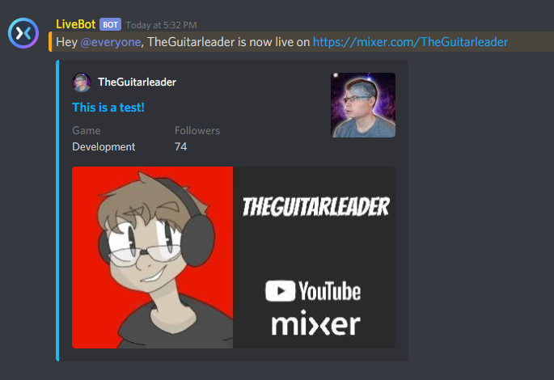

# MixerLive
> Live stream announcements in Discord for Mixer streaming service.

MixerLive is an app that connects to a specific Mixer channel with a channel id through what is 
called constellation. When the specific channel goes live, the app will gather the most recent 
information through the Mixer api and send an embedded message to the channel of your choice 
in your Discord server through the bot of your choice. 



## Setup Guide

_Create the Discord bot_

Go to https://discordapp.com/developers and create new application

Enter name and click create

Under settings go to bot and click add bot

Under OAuth2, in scopes check bot

In bot permissions make sure view channels, send messages, and embed links are checked

Copy the link in scopes

Open the link in new tab and follow the instructions for adding bot to server.

_Updating token in config.json_

Go to https://discordapp.com/developers and click on the application

In setting, under bot, click copy to copy the bot token

Open config.json and paste the token
```
"token":"<Paste it here>",
```

_Updating discordChannelId in config.json_

In the Discord server, right click on the channel and click copy id

Open config.json and paste the Discord channel id
```
"discordChannelId":"<Paste it here>",
```

_Updating mixerChannelId in config.json_

Go to https://mixer.com/api/v1/channels/<your username>?fields=id
Copy the id
```
{"id":<Copy this>}
```
Open config.json and paste the channel id
```
"mixerChannelId":"<Paste it here>"
```

## What if I have a question or need more help?
Feel free to [tweet](https://twitter.com/theguitarleader) or come visit my [Discord Server.](https://discord.gg/KDFzHGK)


## I found a bug, who do I contact?
Head over to the [issues](https://github.com/TheGuitarleader/MixerLive/issues) page and create a new issue.


## I have a new feature idea!
Submit feature requests at the [issues](https://github.com/TheGuitarleader/MixerLive/issues) page. Please note that not all feature requests will be implemented.
